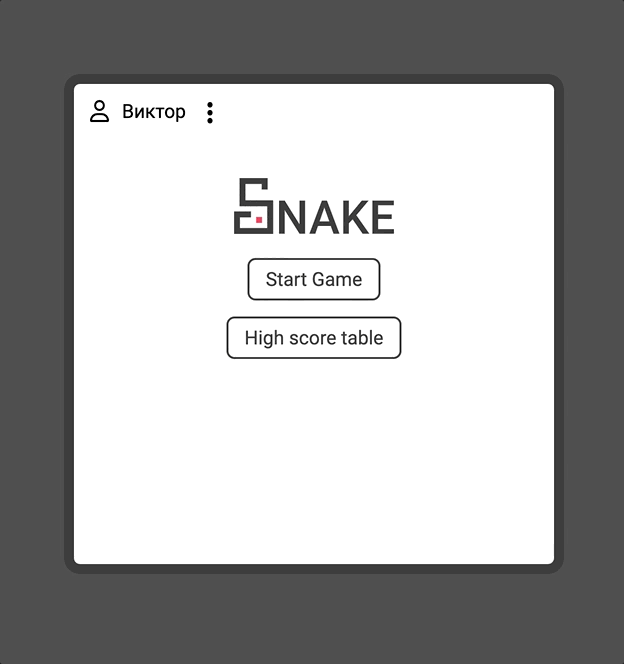

# Snake

Вариация классической игры змейка.

Проект представляет из себя SPA (Single Page Application). Таблица рекордов хранится в localStorage. Игра адаптированна для сенсорных экранов.

**Технологии:** JavaScript, HTML5, Scss

## **Как запустить игру**

[Играть](https://victor-syrkashev.github.io/snake/)

## **Суть игры и особенности**

Ваша задача управлять змейкой и направлять ее в сторону красного квадратика, в моём воображении это яблоки. Как только змейка съедает яблоко, она увеличивается на один сегмент, а вы зарабатываете одно очко!
Цель игры - собрать как можно больше яблок, заработав тем самым большее количество очков и увековечить свое имя в таблице рекордов.

Есть небольшие особенности:

1. Нельзя выходить за границы поля.
2. Нельзя есть собственных хвост.
3. Чем больше вы заработаете очков, тем выше будет скорость.

Игру можно поставить на паузу, для удобства пауза и рестарт также доступны с клавиатуры.
